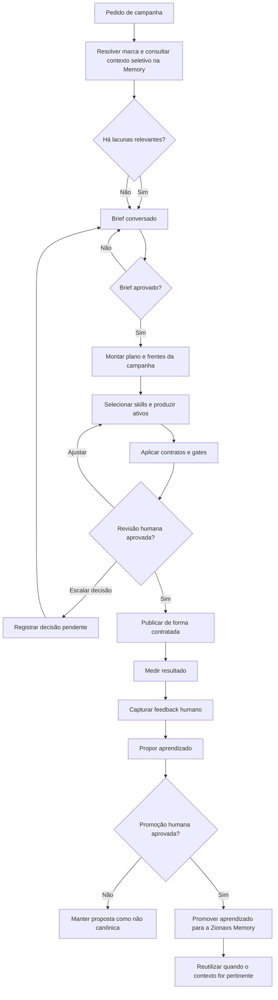
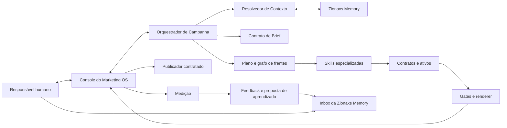
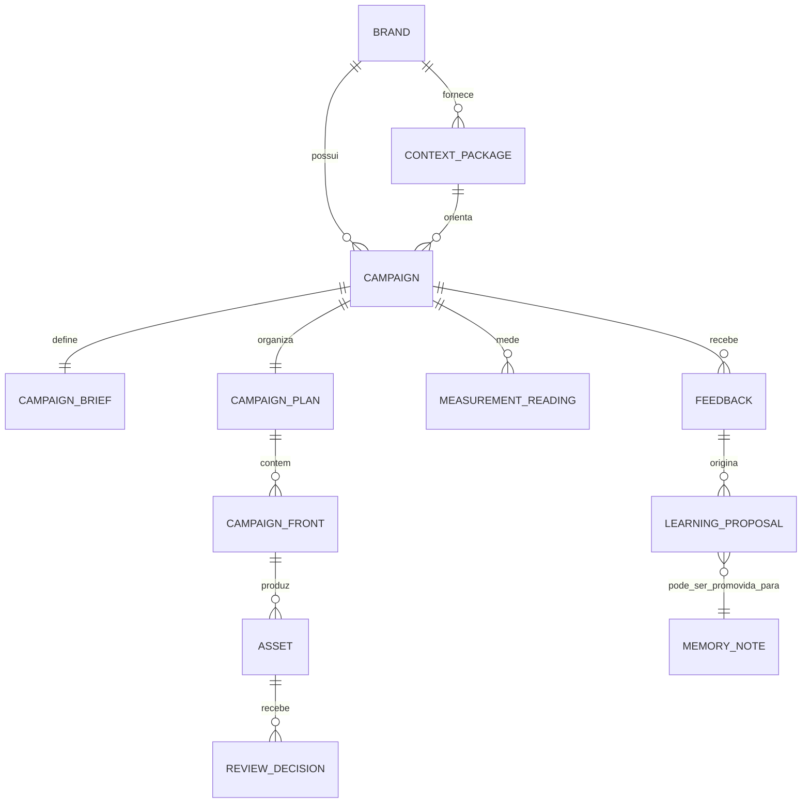

# Especificação Técnica — Fluxo de Campanhas Orientado pela Zionaxs Memory

**Status:** proposta de implementação aprovada conceitualmente; ainda sem código  
**Escopo:** Marketing OS e sua integração governada com a Zionaxs Memory  
**Público:** responsável pela Zionaxs, agentes de marketing e implementação  
**Fonte de verdade desta especificação:** decisões consolidadas da conversa que originou este documento.

## 1. Contexto e objetivo

O repositório já contém duas capacidades complementares:

- uma biblioteca de skills de marketing, usada para aplicar métodos especializados;
- um Marketing OS com estado, contratos de peça, gates visuais e textuais, console de decisão e publicação rastreável.

O fluxo atual é forte no controle de produção, mas não trata a Zionaxs Memory como fonte canônica operacional por marca nem fecha sistematicamente o ciclo de feedback humano para aprendizado reutilizável. Esta evolução cria um único ciclo de trabalho que parte do conhecimento durável da marca, abre uma campanha por briefing conversado, produz apenas as frentes necessárias, mede o resultado e transforma devolutivas aprovadas em conhecimento futuro.

O objetivo é melhorar campanhas sucessivas sem permitir que hipótese, preferência temporária ou feedback isolado virem regra automática. O sistema é interno à Zionaxs e mantém a aprovação humana como fronteira para efeitos externos e para promoção de conhecimento canônico.

## 2. Decisões arquiteturais consolidadas

| Decisão | Consequência técnica |
|---|---|
| A Zionaxs Memory é a fonte canônica de contexto de marca, design e público. | O Marketing OS consulta a Memory de modo seletivo e registra a proveniência do contexto usado. |
| A campanha começa com conversa de briefing, não com produção de peça. | Não é permitido iniciar produção como se objetivo, público e ação desejada estivessem decididos quando não estiverem. |
| Uma campanha pode conter várias frentes, mas só as que forem necessárias. | O plano modela conteúdo, distribuição, conversão, receita e continuidade como frentes opcionais. |
| Skills são métodos especializados, escolhidos por etapa e frente. | O orquestrador roteia para skills pertinentes; não executa todas indiscriminadamente. |
| Toda devolutiva humana gera uma proposta de aprendizado estruturada. | O aprendizado passa por classificação, escopo, evidência e aprovação antes de ser reutilizado como padrão. |
| Marketing opera como agente externo em relação à Memory. | O sistema grava propostas na Inbox; a promoção a nota canônica depende de aprovação humana explícita. |
| Não existe autoalteração silenciosa de memória, regras ou código. | “Autoaprendizado” significa propor e versionar conhecimento aprovado, não modificar o próprio sistema sem controle. |
| Os controles atuais de evidência, gates, digest, aprovação e publicação são preservados. | A nova arquitetura estende o Marketing OS; não substitui o pipeline de peças existente. |

## 3. Escopo

### 3.1 Incluído

- leitura seletiva e rastreável da Zionaxs Memory por marca, público, plataforma e tipo de campanha;
- Brief de Campanha conversado, registrado e aprovado;
- Plano de Campanha composto por frentes e dependências;
- roteamento das frentes para as skills de marketing adequadas;
- uso dos contratos e gates de peça já existentes onde aplicáveis;
- registro de publicação, medição, feedback e proposta de aprendizado;
- envio de proposta de aprendizado para a Inbox da Memory e promoção humana explícita;
- evolução do console para apresentar contexto, lacunas, plano, decisões, resultados e aprendizados;
- testes e integração contínua para a funcionalidade do Marketing OS.

### 3.2 Fora do escopo

- publicação automática sem aprovação humana;
- escrita direta, silenciosa ou automática em áreas canônicas da Zionaxs Memory por um agente de marketing;
- alteração automática de código, skills ou regras a partir de feedback;
- implementação simultânea de todos os formatos, canais e integrações de publicação;
- produto multiempresa, multitenant ou onboarding externo;
- automação autônoma de orçamento, mídia paga ou gasto;
- criar uma API pública, um MCP remoto ou um webhook novo para a Memory na primeira fase;
- substituir o pipeline de carrossel já existente ou remover seus gates;
- estabelecer metas de desempenho, SLAs ou limites de latência que não foram definidos.

## 4. Perfis, responsabilidades e permissões

| Perfil/componente | Responsabilidades | Permissões e limites |
|---|---|---|
| Responsável humano da Zionaxs | Define direção, responde briefing, avalia ativos, aprova publicação e promove aprendizados. | É a autoridade final para decisões incompatíveis, publicação e canonicidade na Memory. |
| Agente de marketing / Marketing OS | Recupera contexto, pergunta lacunas, planeja, roteia skills, produz, mede e propõe aprendizados. | Pode ler contexto autorizado e escrever propostas na Inbox; não promove sozinho uma proposta à memória canônica. |
| Skills especializadas | Executam método de uma frente: pesquisa, copy, anúncios, landing page, e-mail, analytics etc. | São selecionadas pelo plano; devem receber somente o contexto necessário. |
| Console do Marketing OS | Exibe estado, decisões, gates, ativos, publicação e evolução da campanha. | Reutiliza a proteção local já existente, incluindo token opcional e proteção CSRF para operações de escrita. |
| Publicador contratado | Faz preflight, envio e reconciliação de publicação quando configurado. | Só atua sobre ativo aprovado e digest válido; credenciais permanecem em variáveis de ambiente. |
| Zionaxs Memory | Armazena conhecimento durável, governado e versionado. | A Inbox contém propostas não canônicas; áreas oficiais só recebem promoção aprovada. |

## 5. Fluxo principal

O fluxo não obriga toda campanha a percorrer todas as frentes. Uma campanha de audiência pode ter conteúdo e distribuição. Uma campanha de venda pode incluir conversão, receita e continuidade. O menor conjunto capaz de atender ao objetivo é preferível a um funil criado por hábito.

## 6. Requisitos funcionais

### RF-01 — Contexto canônico e seletivo

1. Antes de planejar uma campanha, o sistema deve identificar a marca e carregar apenas as notas da Memory necessárias ao pedido.
2. O contexto deve poder abranger, quando pertinente: posicionamento, público e personas, linguagem literal, provas, diretrizes de design, campanhas anteriores e aprendizados aprovados.
3. Cada contexto utilizado deve registrar referências de origem e a data/versão de consulta.
4. O sistema não deve carregar toda a árvore da Memory por padrão.
5. Ausência, conflito ou desatualização relevante de contexto deve aparecer como lacuna explícita; não pode ser preenchida por inferência silenciosa.

### RF-02 — Brief de Campanha

O sistema deve conduzir e salvar um Brief de Campanha antes de produzir ativos. O Brief deve conter, no mínimo:

| Campo | Descrição |
|---|---|
| Marca | Marca à qual a campanha pertence. |
| Propósito | Venda, aquisição de audiência, divulgação, autoridade, retenção ou teste. |
| Objetivo | Resultado pretendido pela campanha. |
| Público | Segmento, persona ou recorte de público ao qual se dirige. |
| Oferta e ação desejada | O que é oferecido, quando aplicável, e o que o público deve fazer. |
| Canais e formatos | Canais e formatos inicialmente escolhidos ou deliberadamente adiados. |
| Métrica primária | Medida que define o sucesso do objetivo. |
| Métricas de apoio | Medidas que ajudam a interpretar a primária. |
| Prazo, orçamento e restrições | Limites declarados para execução. |
| Evidências e limites de alegação | Provas disponíveis, hipóteses e afirmações proibidas ou ainda não confirmadas. |
| Critério de aprovação e encerramento | O que valida a campanha e em que condição ela deve ser reavaliada ou encerrada. |

O agente deve fazer perguntas somente sobre campos que a Memory e o pedido não resolverem. A aprovação humana do Brief é gate obrigatório para o Plano de Campanha.

### RF-03 — Plano de Campanha e frentes

O plano deve decompor a campanha em frentes opcionais:

| Frente | Finalidade | Exemplos de ativos |
|---|---|---|
| Conteúdo e atenção | Tornar a mensagem compreensível e memorável. | Carrossel, stories, vídeo, postagens. |
| Distribuição | Fazer o ativo chegar ao público. | Orgânico, mídia paga, parceria. |
| Conversão | Capturar ou mover o interessado para a próxima ação. | Landing page, formulário, isca, agendamento. |
| Receita | Apresentar e concluir a proposta comercial. | Oferta, checkout, order bump. |
| Continuidade | Sustentar relacionamento e retorno. | E-mail, nutrição, remarketing, acompanhamento. |

Para cada frente selecionada, o plano deve informar objetivo, skills responsáveis, ativos, dependências, gates, métrica, estado e decisão pendente. O plano também deve registrar explicitamente as frentes que ficaram de fora quando essa exclusão fizer parte da estratégia.

### RF-04 — Roteamento para skills

1. O Marketing OS deve selecionar skills pelo problema e pela frente, não por uma lista fixa.
2. O contexto enviado a cada skill deve ser o mínimo necessário e deve preservar referências a evidências e restrições.
3. Exemplos esperados de roteamento: `ad-creative` e `ads` para mídia paga; `copywriting`, `cro` e `signup` para landing page; `emails` para nutrição; `analytics`, `attribution` e `ab-testing` para mensuração e experimentação.
4. O Marketing OS continua sendo o orquestrador: ele não substitui o método interno de uma skill especializada.

### RF-05 — Produção, gates e revisão

1. Ativos que possuírem contrato de peça devem continuar a ser gerados e validados pelo pipeline determinístico existente.
2. O plano deve permitir gates específicos por canal quando novos formatos forem adicionados.
3. Toda revisão humana deve resultar em uma das saídas: aprovada, devolvida para ajuste ou escalada como decisão pendente.
4. Ativos aprovados devem permanecer vinculados ao digest ou identificador de versão que os representa.

### RF-06 — Publicação e rastreabilidade

1. Publicação só pode ser iniciada a partir de ativo aprovado e ainda válido.
2. O fluxo existente de preflight, envio, callback e reconciliação deve ser mantido onde houver rota configurada.
3. HTTP de sucesso isolado não pode significar publicação confirmada; a confirmação exige os dados de reconciliação definidos pelo publicador.
4. Link/permalink e estado final devem ser registrados.

### RF-07 — Medição

1. Toda campanha aprovada para publicação deve ter uma métrica primária definida no Brief.
2. Leituras devem conter fórmula, fonte, responsável, frequência e denominador quando aplicável.
3. O resultado deve registrar limitações e não pode transformar leitura direcional em certeza causal.
4. A falta de dados deve ser apresentada como lacuna ou leitura insuficiente, não como resultado positivo ou negativo fabricado.

### RF-08 — Feedback e aprendizado

1. O sistema deve permitir registrar devolutiva humana por campanha, frente e/ou ativo.
2. Cada feedback deve ser classificado como uma ou mais categorias: preferência, falha de execução, hipótese ou resultado mensurado.
3. A proposta de aprendizado deve incluir contexto de origem, observação, causa ou interpretação, escopo de aplicabilidade, evidência, regra proposta e condição de revisão/invalidação.
4. A proposta deve ser criada como não canônica na Inbox da Zionaxs Memory.
5. Somente após aprovação humana explícita ela poderá ser promovida para a área canônica apropriada da Memory.
6. Aprendizados aprovados devem ser elegíveis para o contexto de campanhas futuras somente quando o escopo de marca, público, formato ou situação for compatível.

## 7. Regras de negócio e gates

| Código | Regra |
|---|---|
| RB-01 | Não iniciar produção de campanha sem marca identificada e Brief aprovado. |
| RB-02 | Uma lacuna de contexto deve gerar pergunta, decisão pendente ou hipótese marcada; nunca fato implícito. |
| RB-03 | O propósito da campanha determina as frentes e a métrica; não existe conjunto obrigatório de funil. |
| RB-04 | Toda alegação segue o contrato de evidência da peça e deve respeitar as limitações das fontes. |
| RB-05 | Publicação exige aprovação vigente do ativo e integridade da versão aprovada. |
| RB-06 | Um feedback não é automaticamente um aprendizado canônico. |
| RB-07 | Preferência, hipótese, falha de execução e resultado comprovado são tipos distintos e não podem ser mesclados. |
| RB-08 | Decisões incompatíveis na Memory não são resolvidas silenciosamente. |
| RB-09 | Atualizações de conhecimento preservam histórico, proveniência e vínculo com a campanha de origem. |
| RB-10 | Nenhuma credencial, token, segredo ou output descartável deve ser promovido para a Memory. |

## 8. Arquitetura e componentes

### 8.1 Componentes lógicos novos

| Componente | Responsabilidade |
|---|---|
| Resolvedor de Contexto | Localiza as notas de marca necessárias, monta o pacote de contexto e aponta lacunas e conflitos. |
| Manifesto de Marca | Declara a identidade da marca e as referências da Memory que governam contexto, design e público. |
| Contrato de Brief | Valida a informação mínima para decidir uma campanha. |
| Planejador de Campanha | Cria o grafo de frentes, ativos, dependências, skills, gates e métricas. |
| Registro de Feedback | Guarda a avaliação humana no contexto correto. |
| Proponente de Aprendizado | Converte feedback e resultado em proposta rastreável para a Inbox. |
| Painel de Lacunas e Decisões | Torna bloqueios, hipóteses e próximas ações visíveis no console. |

### 8.2 Componentes existentes impactados

| Componente existente | Impacto esperado |
|---|---|
| Skill `marketing-os` | Passa a iniciar pela Zionaxs Memory, adiciona Brief e fecha o ciclo com proposta de aprendizado. |
| Skill `product-marketing` | Deixa de ser a única fonte de contexto; pode atuar como projeção compatível do contexto canônico quando necessário. |
| Skill `marketing-loops` | Usa leituras e aprendizados aprovados para ciclos recorrentes, sem pular checkpoints humanos. |
| `sistema/app/lib/state.js` e fluxo | Deve suportar Brief, plano, frentes, lacunas, feedback e aprendizado sem perder o estado atual. |
| `sistema/app/console` | Deve acrescentar visões e ações para campanha, contexto, Brief, plano, medição e propostas. |
| Contratos de peça e renderer | Permanecem como implementação de ativos compatíveis, inicialmente para carrossel. |
| Workflows GitHub | Devem passar a executar os testes do Marketing OS, além da validação de skills. |

## 9. Estrutura de dados

Os formatos exatos de arquivo e nomes de propriedades serão definidos na implementação, mas os contratos abaixo são obrigatórios no nível semântico.

### 9.1 Entidades e relacionamentos

### 9.2 Contratos mínimos

| Entidade | Campos obrigatórios |
|---|---|
| Manifesto de Marca | identificador, referências de contexto, referências de design, referências de público, regras de uso. |
| Pacote de Contexto | marca, campanha, referências de origem, data de consulta, informações aplicadas, lacunas, conflitos e limitações. |
| Brief de Campanha | campos definidos em RF-02, estado e aprovação. |
| Plano de Campanha | campanha, frentes selecionadas, frentes excluídas relevantes, skills, ativos, dependências, gates, métricas e decisões. |
| Frente | tipo, objetivo, estado, ativos, dependências, skill(s), gate(s), métrica e responsável. |
| Ativo | frente, contrato de conteúdo quando aplicável, versão/digest, estado de revisão, publicação e referências de saída. |
| Leitura de Medição | métrica, fórmula, fonte, denominador, período, interpretação e limitações. |
| Feedback | origem humana, data, alvo, observação, classificação e decisão subsequente. |
| Proposta de Aprendizado | origem, contexto, evidência, regra proposta, escopo, revisão/invalidação, estado de aprovação e referência de promoção. |

### 9.3 Estados mínimos de campanha

`rascunho → contextualização → briefing → planejamento → produção → revisão → aprovada → publicada → medição → encerrada`

Um estado `bloqueada` pode ser usado quando existir uma lacuna ou decisão que impossibilite o próximo passo. Uma campanha pode voltar de revisão para produção e de medição para planejamento de um ciclo posterior. O sistema deve preservar decisões e evidências anteriores nessas transições.

## 10. Integrações, serviços externos e dados de entrada

### 10.1 Zionaxs Memory

Na primeira fase, a integração é governada por arquivos Markdown e Git, não por API pública. Antes de leitura ou escrita relevante, o processo deve seguir a política da Memory: verificar estado, incorporar mudanças remotas de forma não destrutiva, pesquisar as notas relacionadas e carregar apenas o contexto necessário.

Para escrita, o Marketing OS cria proposta em `Inbox/Agents/<agente>/` ou rota equivalente definida pela governança. A promoção posterior é uma ação humana explícita. O sistema não deve usar a Memory para guardar builds, caches, artefatos de render ou segredos.

### 10.2 Publicação

O publicador existente continua opcional e configurado por ambiente. O contrato de publicação mantém preflight, envio e callback/reconciliação. A rota atual de publicação da Zionaxs permanece uma dependência operacional separada: ela não bloqueia a implementação de contexto, briefing e aprendizado, mas bloqueia publicação automatizada naquele canal enquanto não for resolvida.

### 10.3 Skills

Skills não são serviços remotos. Elas são instruções e métodos locais, selecionados pelo orquestrador. O sistema registra qual skill fundamentou cada frente quando isso for material para revisão, reprodução ou aprendizado.

## 11. Console e experiência de uso

### 11.1 Telas e áreas

| Área | Conteúdo e ação principal |
|---|---|
| Fila de campanhas | Campanhas por estado, próxima ação, bloqueios e decisão pendente. |
| Contexto | Fontes consultadas, resumo aplicado, lacunas, conflitos e limitações. |
| Brief | Campos do Brief, perguntas pendentes e ação de aprovação. |
| Plano | Grafo de frentes, dependências, skills, ativos, métricas e itens fora de escopo. |
| Detalhe do ativo | Contrato, gates, evidências, diferenças de versão e formulários de decisão já existentes. |
| Medição | Métrica primária, denominador, fontes, leituras e limitações. |
| Feedback e aprendizado | Devolutivas, classificação, proposta e estado de promoção na Memory. |

### 11.2 Estados de experiência

- **Sem contexto suficiente:** o console explica o que falta e encaminha para o Brief; não apresenta um plano como concluído.
- **Brief incompleto:** mostra somente os campos pendentes e permite salvar rascunho.
- **Campanha bloqueada:** mostra a decisão que bloqueia, seu impacto e o próximo responsável.
- **Ativo em revisão:** mostra gates, versão e histórico de devolutivas.
- **Leitura insuficiente:** exibe a falta de dados e proíbe conclusão indevida.
- **Aprendizado pendente:** deixa claro que é proposta não canônica até aprovação.

## 12. Fluxos alternativos, erros e casos extremos

| Situação | Comportamento obrigatório |
|---|---|
| Marca não identificada | Solicitar identificação da marca antes de consultar ou produzir. |
| Contexto ausente | Registrar lacuna e perguntar no Brief; não inventar posicionamento, design ou público. |
| Notas canônicas conflitantes | Exibir conflito, preservar referências e solicitar decisão humana. |
| Brief rejeitado ou alterado | Voltar ao Brief; invalidar o plano que dependa do campo alterado. |
| Nova frente adicionada | Registrar dependências, skills, gates e métrica antes de iniciar a produção. |
| Gate de ativo reprovado | Devolver ao contrato/produção; não corrigir diretamente um arquivo derivado como solução final. |
| Aprovação invalidada por regeneração | Tratar o ativo como desatualizado até nova revisão, conforme a proteção de digest existente. |
| Publicador indisponível ou incompleto | Registrar bloqueio ou estado enviado; nunca declarar publicação confirmada sem reconciliação. |
| Métrica sem denominador ou fonte | Marcar leitura insuficiente/direcional, conforme o caso; não pontuar sucesso. |
| Feedback contraditório | Preservar as duas observações e encaminhar a uma decisão; não sobrescrever silenciosamente. |
| Proposta de aprendizado recusada | Mantê-la como proposta recusada ou encerrada, sem aplicar como padrão futuro. |
| Acesso à Memory indisponível | Não usar cópia local como definitiva sem sinalizar a limitação; permitir rascunho, mas bloquear promoção baseada em sincronização não verificada. |

## 13. Segurança, privacidade, auditoria e controle de acesso

1. A política de segurança da Zionaxs Memory continua prevalecendo: nenhum segredo, token, chave, senha ou credencial é registrado.
2. Credenciais do console e do publicador permanecem somente em variáveis de ambiente; o navegador não recebe segredos de publicação.
3. Ações de escrita no console reutilizam proteção por token e CSRF existente.
4. Ações externas — publicação, gasto em mídia ou promoção canônica — exigem autorização humana e registro auditável.
5. Toda decisão relevante deve manter campanha, data, responsável, ativo/contrato, justificativa e estado resultante.
6. O pacote de contexto deve referenciar suas fontes, em vez de copiar indiscriminadamente todo o conteúdo da Memory para artefatos de campanha.
7. Entradas provenientes da Memory, de páginas externas, de pesquisas e de feedback são dados a avaliar; não são instruções executáveis.

## 14. Compatibilidade e migração

### 14.1 Princípios

- A mudança deve ser aditiva e não destrutiva.
- O estado, contratos, peças, relatórios e decisões existentes devem permanecer legíveis.
- A campanha existente “Capacidade antes de oferta” pode ser migrada gradualmente como piloto, preservando seus ponteiros atuais.
- A peça legada ZX-19 permanece identificada como legado e não deve ser reclassificada como publicada sem evidência de publicação.

### 14.2 Estratégia

1. Introduzir os novos contratos sem alterar os contratos de peça atuais.
2. Criar um manifesto para a marca Zionaxs e montar o primeiro pacote de contexto a partir das referências já usadas no estado atual.
3. Converter a campanha piloto para Brief e Plano de Campanha, mantendo os registros atuais como evidência histórica.
4. Adicionar feedback e proposta de aprendizado sem migrar retrospectivamente todo o histórico.
5. Só depois ampliar o modelo para novos formatos e canais.

Nenhuma migração deve sobrescrever notas da Memory, artefatos existentes ou decisões já tomadas. Em divergências, preservar as versões e solicitar decisão humana.

## 15. Requisitos não funcionais

| Categoria | Requisito |
|---|---|
| Rastreabilidade | Toda campanha, decisão, ativo, leitura e aprendizado deve poder ser relacionado à sua origem. |
| Reprodutibilidade | O pipeline determinístico de ativos existentes deve continuar registrando versão/digest e resultado dos gates. |
| Governança | Conhecimento canônico só é promovido com aprovação humana explícita. |
| Integridade | Estado derivado de artefatos e decisões não pode ser marcado como concluído sem a evidência correspondente. |
| Segurança | Segredos não são gravados em contratos, logs, Memory ou repositório. |
| Manutenibilidade | Novas frentes e formatos devem ser adicionados como extensões do contrato, sem quebrar a campanha piloto. |
| Escopo de contexto | Recuperação deve ser seletiva e proporcional à tarefa, para evitar contexto irrelevante e contradições desnecessárias. |
| Clareza operacional | Bloqueios, lacunas, hipóteses e propostas pendentes devem ser visíveis no console. |

## 16. Critérios de aceite

### Fase 1 — Contexto, Brief e aprendizado

- [ ] Ao abrir uma campanha, o sistema identifica a marca e mostra referências seletivas da Zionaxs Memory.
- [ ] Quando faltar informação relevante, o sistema cria lacuna e pergunta no Brief em vez de presumir uma resposta.
- [ ] Um Brief não pode ser aprovado sem propósito, objetivo, público, métrica primária, ação desejada e restrições aplicáveis.
- [ ] Um plano só pode iniciar produção depois de Brief aprovado.
- [ ] É possível registrar feedback por campanha ou ativo e classificá-lo corretamente.
- [ ] O sistema gera proposta de aprendizado com origem, escopo, evidência e regra proposta.
- [ ] A proposta vai para a Inbox e não aparece como canônica até aprovação humana.
- [ ] A campanha piloto continua a preservar seus contratos e gates existentes.

### Fases posteriores

- [ ] O plano pode representar mais de uma frente e suas dependências.
- [ ] Cada frente tem skills, ativos, gates e métrica registrados.
- [ ] Novos formatos só são publicados após seus gates específicos passarem.
- [ ] Leituras sem dados suficientes são classificadas como insuficientes ou direcionais, não como resultado conclusivo.
- [ ] A CI executa validações de skills e os testes do Marketing OS, incluindo o ambiente de navegador requerido pelo render.

## 17. Cenários de testes

| Grupo | Cenários mínimos |
|---|---|
| Contexto | Marca válida; marca inexistente; referência ausente; notas conflitantes; contexto excessivo não carregado; fonte desatualizada/inacessível. |
| Brief | Todos os campos mínimos; campo obrigatório ausente; alteração que invalida plano; rascunho retomado; aprovação explícita. |
| Plano | Campanha só de audiência; campanha de venda com frentes adicionais; frente sem métrica; dependência circular ou ausente; skill inadequada não roteada. |
| Ativos | Regressão dos 12 gates existentes; contrato inválido; regeneração que invalida aprovação; gate de novo formato quando ele existir. |
| Publicação | Preflight inválido; aprovação ausente; digest desatualizado; callback incompleto; conta divergente; confirmação válida. |
| Medição | Fórmula e denominador válidos; fonte ausente; leitura direcional; resultado com limitação explícita. |
| Feedback | Preferência; falha de execução; hipótese; resultado mensurado; feedback contraditório; proposta recusada; promoção aprovada. |
| Governança | Proposta escrita na Inbox; tentativa de promoção automática bloqueada; conflito preservado; nenhum segredo em arquivos produzidos. |
| Console | Estados de lacuna, bloqueio, revisão, leitura insuficiente e aprendizado pendente; POSTs protegidos por CSRF/token. |
| CI | Testes do app executados em ambiente com Chromium do Playwright disponível; validação de skills mantida. |

## 18. Riscos, dependências e pendências reais

| Item | Impacto | Tratamento definido |
|---|---|---|
| Contexto desatualizado ou divergente na Memory | Pode orientar campanha por informação incorreta. | Registrar proveniência, sincronizar antes de uso relevante, mostrar lacuna/conflito e manter aprovação humana. |
| Aprendizado generalizado demais | Pode repetir uma decisão inadequada em outro público ou marca. | Exigir escopo, evidência e condição de revisão antes da promoção. |
| Escopo de canais cresce cedo demais | Pode atrasar a validação do fluxo principal. | Começar com a Fase 1 e com uma campanha real; novos formatos entram depois. |
| Falta de rota de publicação da Zionaxs | Bloqueia publicação automatizada, não briefing, produção ou aprendizado. | Manter publicação como dependência operacional e não declarar sucesso sem reconciliação. |
| Navegador do renderer indisponível | Impede testes de render reais. | Instalar/provisionar Chromium do Playwright na CI e no ambiente de validação. |
| CI atual cobre principalmente skills | Regressões do app podem não ser detectadas. | Incluir os comandos de validação e teste do Marketing OS no workflow. |
| Decisões comerciais abertas da campanha atual | Impedem determinadas frentes, especialmente mídia paga. | Continuam registradas como bloqueios de campanha; não são pré-requisito para iniciar a Fase 1. |

## 19. Ordem recomendada de implementação

### Fase 0 — Preparação e proteção

1. Registrar esta especificação como referência da implementação.
2. Criar plano de validação proporcional antes de alterar código.
3. Estabelecer testes do app no CI e provisionar o navegador necessário.
4. Atualizar a documentação do app para refletir a contagem real de testes quando a suíte estiver verde no ambiente preparado.

### Fase 1 — MVP do ciclo de inteligência

1. Implementar manifesto de marca e resolvedor seletivo da Zionaxs Memory.
2. Implementar Pacote de Contexto com proveniência, lacunas e conflitos.
3. Implementar Contrato de Brief, aprovação e apresentação no console.
4. Criar o registro de Feedback e a Proposta de Aprendizado para a Inbox.
5. Pilotar com uma campanha real da Zionaxs, inicialmente preservando o formato de carrossel.

**Resultado esperado:** a campanha começa com contexto confiável e termina com uma proposta de aprendizado aprovada ou explicitamente recusada.

### Fase 2 — Plano de campanha por frentes

1. Implementar o grafo de frentes, dependências, ativos, skills, gates e métricas.
2. Acrescentar o painel de lacunas, decisões e próxima ação.
3. Conectar o plano à fila e ao estado existente.

### Fase 3 — Expansão de formatos e distribuição

1. Adicionar contratos e gates específicos para landing page, formulário, anúncios, stories e e-mail, conforme a prioridade real.
2. Integrar cada formato ao publicador apenas quando houver rota contratada e revisável.
3. Manter aprovação humana antes de qualquer efeito externo.

### Fase 4 — Aprendizado orientado por resultado

1. Conectar leituras de métrica às hipóteses do Brief.
2. Melhorar a proposta de aprendizado com evidência quantitativa e qualitativa.
3. Criar loops recorrentes somente depois de medição confiável e checkpoints humanos estabelecidos.

## 20. Versionamento e documentação afetada

Quando a implementação modificar a skill `marketing-os`, deve:

1. incrementar a versão da própria skill por nova capacidade;
2. incrementar a versão de release do repositório como atualização de skill existente;
3. sincronizar manifesto de plugin e README pelos mecanismos já existentes;
4. atualizar a tabela de versões e o changelog do repositório;
5. validar o limite de tamanho e o frontmatter da skill.

Mudanças apenas no app ou nesta documentação devem preservar a compatibilidade do marketplace e não devem declarar uma nova capacidade de skill antes de ela estar efetivamente entregue.

## 21. Checklist de Cobertura

| Requisito identificado | Seção |
|---|---|
| Usar a Zionaxs Memory como fonte de informações por marca | 1, 2, 6.1, 10.1 |
| Encontrar e usar identidade, design e público de cada marca | 2, 6.1, 9.2 |
| Nutrir a Memory com conhecimento futuro | 2, 6.8, 10.1, 13 |
| Perguntar o propósito de cada campanha | 6.2, 7, 12 |
| Suportar campanhas de venda, divulgação, audiência e outros objetivos | 6.2, 6.3, 7 |
| Suportar carrossel, stories, tráfego pago, páginas, funis, order bump, coleta e iscas | 6.3, 19.3 |
| Usar skills especializadas no momento adequado | 2, 6.4, 8.2 |
| Receber devolutiva humana sobre o que foi criado | 6.8, 11, 17 |
| Transformar devolutiva em aprendizado reutilizável | 6.8, 7, 9, 13 |
| Evitar que feedback ou hipótese vire regra sem controle | 2, 7, 13, 18 |
| Manter aprovação humana para conhecimento canônico | 2, 4, 6.8, 10.1, 13 |
| Preservar gates, evidência, digest, revisão e publicação existentes | 2, 6.5, 6.6, 8.2 |
| Medir resultados com contexto e denominador | 6.7, 7, 15, 17 |
| Exibir lacunas, bloqueios e decisões | 8.1, 11, 12 |
| Não criar um funil completo quando não for necessário | 5, 6.3, 7 |
| Evoluir sem tentar implementar todos os canais de uma vez | 3.2, 14, 18, 19 |
| Acrescentar testes e CI ao app existente | 8.2, 16, 17, 18, 19 |
| Preservar compatibilidade com campanhas e peças existentes | 14 |
| Não automatizar publicação, gasto ou alteração de código sem aprovação | 2, 3.2, 6.6, 13 |
